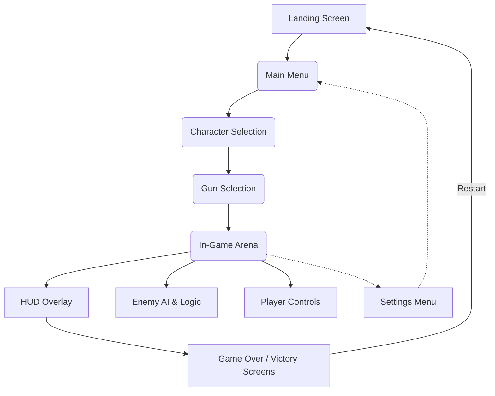

# Architecture Overview: Warzone Strike Unity Frontend

## 1. High-Level Architecture

The unity_frontend is a React-based application that contains all the logic, UI, and data required to run the 3D game entirely client-side. It uses modular React components, local state handling, and local storage for persistence. No external backend is required.

---

## 2. Major Components

### Landing & Selection
- **LandingScreen**: Animated background, game title, menu buttons
- **CharacterSelection**: Displays available characters with icons/previews
- **GunSelection**: Shows available weapons, previews, and allows selection

### Core Gameplay
- **GameArena**: The 3D game world; renders stage, player, enemies, and dynamic objects
- **EnemyAI**: Logic for bot pathfinding, attacking, and states
- **PlayerController**: Handles movement, shooting, switching weapons and views, health
- **CameraManager**: Enables smooth transitions between FPS and third-person perspectives

### UI Overlays
- **HUD**: Displays player stats (health, ammo, weapon, score, view mode) as overlays
- **MiniMap** (optional): Bird’s-eye overlay of arena
- **SettingsMenu**: Volume, control guide, music toggle
- **GameOverScreen**: Shown when user wins or loses, offers restart/menu options

### State Management and Storage
- **GameState**: Local state for session, selections, and in-game data
- **LocalStorageAdapter**: Reads/writes selected options and progress to browser storage

### Utility & polish
- **AudioManager**: Background music, sound effect triggers
- **ThemeProvider**: Theme/color context

---

## 3. Component Relationships

- **Screen Flow**: Users move from Landing → Character Selection → Gun Selection → Game Arena
- **Game Loop**: In-game, the `GameArena` manages updates (AI, player action, collision, scoring). State updates propagate to the `HUD`.
- **UI & Controls**: Components communicate via props/context for game state, selections, and settings. Core state handled in top-level (App/GameState).

---

## 4. Expected User Flow

1. **Landing Screen**
2. Main menu (Play, Settings, etc.)
3. Character and gun selection screens
4. Main 3D arena: player controls and gameplay
5. On death/victory, transitions to Game Over/Victory screen
6. User can restart or return to main menu at any point

---

## 5. Dependencies

The base template uses:
- `react`
- `react-dom`
- `react-scripts` (for CRA-based build)

**Recommended additional dependencies for 3D and game development:**
- [`three`](https://www.npmjs.com/package/three): Core 3D rendering (low-level)
- [`@react-three/fiber`](https://www.npmjs.com/package/@react-three/fiber): React renderer for Three.js scenes and meshes
- [`@react-three/drei`](https://www.npmjs.com/package/@react-three/drei): Useful helpers for 3D scenes in React Three Fiber
- [`@react-spring/three`](https://www.npmjs.com/package/@react-spring/three): Animations for 3D objects (optional)
- [`zustand`](https://www.npmjs.com/package/zustand): Lightweight state management (optional, could use React Context instead)
- (Optional) `howler`, `react-use-sound` for advanced audio controls

---

## 6. Future Extensibility

The architecture supports extensibility via:
* Adding new screens or overlays as components
* Introducing new 3D assets into the arena via modular components
* Swapping state management/store
* Expanding settings/options

---

## 7. Notes

- The main application entry is `src/index.js` and `src/App.js`.
- CSS and theme variables are defined in `src/App.css` and are based on KAVIA branding/customization.
- All code runs entirely client-side in the browser; assets can be bundled via Webpack or imported as static files.
